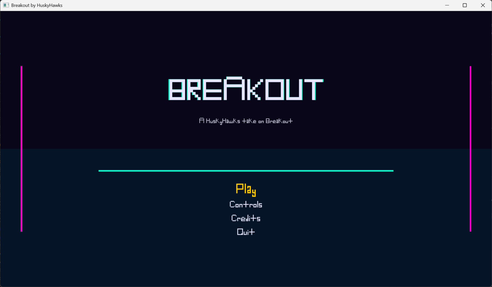
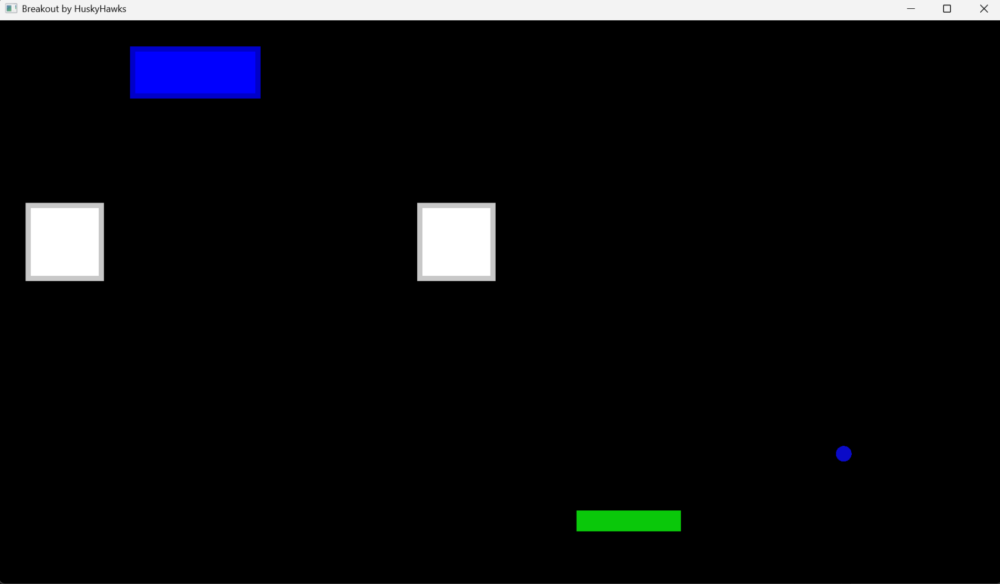

# 🧱 HuskyHawks Breakout Game 

A classic **Breakout-style arcade game** built in **C++** using **SFML** and **CMake**. This game features neon retro graphics, smooth animations, and multiple screens including a title with menu, gameplay controls, credits and quit.


---


This project recreates the retro brick-breaker experience where the player controls a paddle to bounce a ball and destroy bricks. The objective is to clear all bricks without letting the ball fall below the paddle.





## 🎮 Gameplay

- Move the paddle left and right (with the left and right arrow keys) to keep the ball in play.
- The ball bounces off walls, the paddle, and bricks.
- Bricks disappear when hit.
- The player wins when all bricks are destroyed.
- The player loses when the ball falls below the paddle.


## ✨ Features

- Title screen with glow effects and neon accents.
- Menu with **Play, Control, Credits, and Quit** options.
- Ball and paddle movement with collision detection.
- Smooth frame movement using deltaTime.


## 🕹️ Controls

**In Menu:**
- 'Up' / 'Down' arrows: Move Selection
- 'Enter' key: Select Menu Option

**During Gameplay:**
- 'Left' arrow: Moves paddle to the left
- 'Right' arrow: Moves paddle to the right


## 💻 Tech Stack

- **Language:** C++ (C++17)
- **Graphics Library:** SFML (Simple and Fast Multimedia Library)
- **Build System:** CMake
- **Design Approach:** Object-Oriented Programming


## ⚙️ Requirements

Before building the project, ensure you have:

- A C++17 (or higher) compatible compiler (g++, clang++, etc.)
- CMake (3.16 or newer recommended)
- SFML installed on your system (2.5+)


## 📦 Installing SFML

This project requires **SFML (Simple and Fast Multimedia Library)** and **CMake** to compile and run.

### macOS

Follow the official installation instructions:

- CMake: https://cmake.org/download/
- SFML: https://www.sfml-dev.org/download.php

Alternatively, if you use Homebrew:

```bash
brew install sfml cmake
```

### Ubuntu / Linux

Update packages and install dependencies:

```bash
sudo apt update
sudo apt install libsfml-dev cmake
```

### Windows

1. Download **CMake**: https://cmake.org/download/

2. Download **SFML**:  https://www.sfml-dev.org/download.php

3. Install CMake and make sure **"Add CMake to PATH"** is selected.

4. Extract the SFML folder and ensure CMake can locate it when building the project.


## 🔨Building the Project

From the root directory of the repository:

```bash
mkdir build
cd build
cmake ..
make
```

---
## 🚀 Running the Game

After building the project, go to the `build` directory:

```bash
cd build
```

List the files to find the generated executable:

```bash
ls
```

Run the executable shown in the output. For example:

```bash
./main
```

**Note that this is unique to your machine, so we use CMake to make builds of the same program in different environments.**

---


## 👥 Team
- Tanisha Thakare
- Kari Severud
- Kaleb Fikadu
- Mitesh Samal
- David Hochberg
- Miles Vollmer

## 🎉 Acknowledgements

Special thanks to **SFML** for providing the graphics library used to build this game.


